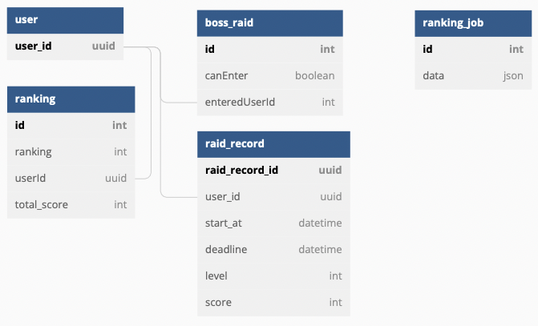

# boss-raid-ranking-api

랭킹시스템이 있는 보스레이드 게임 API

## 목차 🙇‍♂️

- [Skills](#👨‍🔧-skills)
- [서비스개요](#📑-서비스-개요)
- [구현사항](#🛠-구현-사항)
- [ERD](#🚧-erd)
- [프로젝트 실행](#🚀-프로젝트-실행)
- [문서](#📚-문서)

## 👨‍🔧 Skills

### API

<div>
   
   
  
  
</div>

### ORM


### DB


### Docs


## 📑 서비스 개요

## 🛠 구현 사항

## 🚧 ERD

[dbdiagram.io](https://dbdiagram.io/d/63242deb0911f91ba5c6425b)



## 🚀 프로젝트 실행

### 1. .env 작성

```text
MODE="prod" # dev, prod
PORT=3000
```

### 2. 프로젝트 실행

```bash
# npm
$ npm install

$ npm build; npm run start:prod

# yarn
$ yarn

$ yarn build; yarn start:prod
```

## 📚 문서

### [Local Swagger API](http://localhost:3000/docs)
